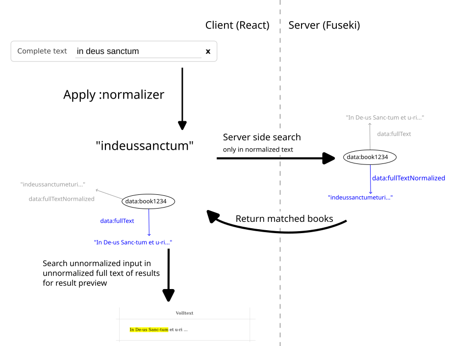

# Full text search

For string attributes, Monodi provides additional options for searching, that are especially useful for full text search
(i.e. string attributes with long texts).

A **normalization** can be applied to the user input to make search resistant to e.g. different spellings or punctuation.
For this to work, an additional attribute has to be added, which holds the normalized text in the backend. The
normalization has to be provided as a JavaScript function for transforming user input.

A **preview** of the context where the text matched the search can be shown. The amount of shown context can be either
specified as an amount of lines or words. As the search runs on the normalized input, this context is found by matching
the *unnormalized* user input to the unnormalized text, using a distance function.

Here is an example from Corpus Monodicum, which we will look at in detail below:

```turtle
data:fullText
    a              rdf:Property ;
    rdfs:label     "Volltext"@de,"Complete text"@en,"disparue"@fr  ;
    :searchOrder   6 ;
    rdfs:domain    data:document  ;
    :normalization [
        :attribute data:fullTextNormalized;
        :normalizer """value => value.normalize("NFD").replace(/[\\u0300-\\u036f]/g, "").replace(/\\s+/g, "").replace(/-/g, "")"""
    ];
    :searchPreview [
        :label "Volltext"@de,"Complete text"@en,"disparue"@fr;
        :config [
            :contextKind "words";
            :contextCount 5;
            :maxDistanceRatio 0.5;
        ]
    ];
    rdfs:range     :string.
```

Here, `data:fullText` is the attribute, which holds the unnormalized full text of the document.

## Normalization

The predicate `:normalization` takes a node with two required predicates:

- `:attribute` contains the IRI of the attribute, that holds the normalized text.
- `:normalizer` contains a JavaScript arrow function, which applies the normalization to the search terms entered by
  the user. Note that all searches in Monodi are case insensitive, so converting to lower case is not required.
  The example function applies a unicode normalization, removes combining characters, whitespace and dashes.

**Important:** Monodi only applies the normalization to user input on the client side. The server side requires the
normalized text in the RDF class instances. So in this example, instances of `data:document` should have a
`data:fullTextNormalized` predicate.

## Search preview

The predicate `:searchPreview` takes a node with the settings for displaying context of the matched text. Note that no
`:headerOrder` is set on `data:fullText`, as this would display the whole text in the result table instead of a snippet.
The following predicates should be set for the `:searchPreview` object node:

- `:label` is used as header for the column in the search result table. This may be different from the attribute label,
  if desired.
- `:config` takes a node with the following predicates:
    - `:contextKind` can either be "words" or "lines, and defines how context around a found match is selected.
    - `:contextCount` is the amount of words and lines to show before and after the match
    - `:maxDistanceRatio` sets the maximum Levensthein distance between the user input and the text to count as a match.
      This is given as a ratio of the input length, i.e. with a ratio of 0.5, the maximum distance for a 10 character
      search term would be 5. Looking the user text up via distance function is required, as there is no mapping
      from a position in the normalized text to one in the unnormalized text.

The following diagram illustrates the whole search process, based on the above example attribute:



1. User enters text `in deus sanctum`
2. The normalizer is applied, resulting in `indeussanctum`
3. The client sends a request to search for `indeussanctum` in the `data:fullTextNormalized`.
4. The server replies with all matched books (including all attributes), including the one shown with the normalized
   text `indeussanctumeturi...`.
5. The client applies a fuzzy search using Levensthein distance, searching the plain user input `in deus sanctum` in the
   unnormalized text, which contains `In De-us Sanc-tum et u-ri...`
6. `In De-us Sanc-tum` matches, so in the result table, this match plus at most 5 words before and after it are shown
   (as configured above). The match itself is highlighted.
