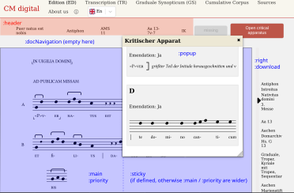
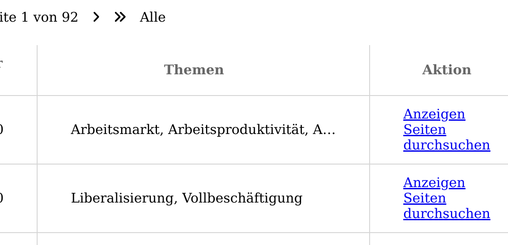
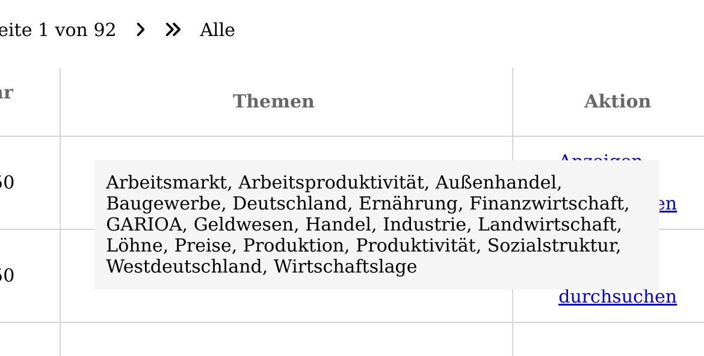

# Monodi RDF Format


## TODOs - not yet documented:
- htmlImageCollection

## Introduction

All configuration and data in Monodi is done via RDF, served with an Apache Fuseki instance. Fuseki reads the RDF from
[Turtle](turtle.md) files.

There are three major parts in Monodi's data format:

- [Global settings](#global-settings) are not tied to a document type, e.g. the start page, static pages linked in the
	navigation or custom CSS
- [Class definitions](#class-definitions) define the types of document the viewer should display
- Instances are the actual documents, which specify the fields defined in the corresponding class. They use the
  attributes defined for a class as predicates. Examples are given in the section on classes.


The following IRI prefixes are used in the documentation and should be defined in your Turtle file:

```turtle
# Nodes and Predicates defined by Monodi
@prefix : <http://olyro.de/mondiview/> .

# Appliction data, e.g. class and attribute names as well as instances, but also global settings
@prefix data: <http://monodicum/> .

# Standard RDF IRIs for class definitions
@prefix rdf: <http://www.w3.org/1999/02/22-rdf-syntax-ns#> .
@prefix rdfs: <http://www.w3.org/2000/01/rdf-schema#> .
```

## Global settings

There are some predefined nodes that Monodi expects to exist.

### Version

The `data:version` node should have a `rdfs:label` predicate with the current version of the data. This is used to
invalidate the cache when the data changes. The recommended way is to use the modification timestamp:

```turtle
data:version  a rdf:Property.
data:version  rdfs:label rdf:2024-03-05T14:00:37.068686939Z.
```

### Static Content

The parts of the application that do not depend on the data instances can be modified via several nodes with
a `:hasContent` predicate, e.g. title texts, start page and static pages. Unless specified otherwise, all subjects
expect language tagged strings as objects for the `:hasContent` predicate.

#### Titles

The application title can be set with the nodes `:tabTitle` (`<title>` tag) and `:headerTitle` (text in the navigation
bar). Example:

```turtle
:tabTitle :hasContent "Corpus Monodicum"@de, "Corpus Monodicum"@en.
:headerTitle :hasContent "CM Digital"@de, "CM Digital"@en.
```
#### Main Page

The start page is separated into three parts. The middle part is a list of the available searches, defined by the
classes, while the parts above and below are configurable via the nodes `:mainPagePreSearches` and
`:mainPagePostSearches`, which both may contain HTML. Example:

```turtle
:mainPagePreSearches :hasContent
        """
        <h1 class="cm-main_prestage">PRESTAGE (Digitaler Raum)</h1>
        <h1 class="cm-main_h1">CORPUS MONODICUM</h1>
        """@de,
        """
        <h1 class="cm-main_prestage">PRESTAGE (Digital Room)</h1>
        <h1 class="cm-main_h1">CORPUS MONODICUM</h1>
        """@en.

:mainPagePostSearches :hasContent
        """
        <div class="logos">
                
        </div>
        """@de,
        """
        <div class="logos">
                
        </div>
        """@en.
```

#### Footer information

The footer contains a copyright notice set via the subject `:copyright`, a plaintext field set via `:footer`, and a list
of links, which are explained below in the [Custom pages](#custom-pages) section.

```turtle
:copyright :hasContent
        "© 2020-2023 Corpus Monodicum"@de,
        "© 2020-2023 Corpus Monodicum"@en.
:footer :hasContent
        "Das hier steht ganz unten"@de,
        "This is at the bottom"@en.
```

#### Custom CSS and Javascript

Custom styling can be added via the `:customCss` node, which should contain valid CSS, which is inserted via a `<style>`
tag. This can be used to modify the appearance or even hide parts of the UI, if the project requires it. Example:

```turtle
:customCss :hasContent """
/* change title bar colors */
:root {
    --titleColor: white;
    --diwBgColor: #00786B;
    --diwFgColor: #FFFFFF;
}
.app-main > .header, .app-main > .footer {
    background: var(--diwBgColor);
    color: var(--diwFgColor);
}
"""
```

The `:customJavascript` node expects Javascript code, which is evaluated via `new Function(customJavascript)()` in the
application context.

```turtle
:customJavascript :hasContent """
	window.alert("Hello!"); // annoy visitors on opening the page
"""
```

*Note: `:customCss` and `:customJavascript` should not use language tagged strings.*

#### Custom pages and navigation links

The navigation bar and footer can be extended with custom links. These can point to:

- **Static subpages** — HTML content stored directly in the RDF, rendered as a page in the viewer
- **External URLs** — links to arbitrary `http://` / `https://` addresses, opening in a new tab
- **Internal routes without content** — links to routes that already exist (e.g. a pre-configured search URL)

The following predicates control the link:

- `:hasTitle` (required for the link to appear in the nav/footer) — the link text, as a language-tagged string
- `:hasRoute` — the URL target:
  - A plain path segment (e.g. `"impressum"`) creates an internal route at `/<segment>`
  - An absolute URL starting with `http://` or `https://` creates an external link (opens in a new tab)
  - Any other internal path (e.g. a search URL) can be used to link to existing routes
- `:hasContent` (optional) — language-tagged HTML string; if present, the viewer renders it when the internal route is visited
- `:position` — a blank node with any of the following predicates. Each takes a number as its object,
	which is used to sort the links in the same location.
	- `:left` to place the link in the left part of the navigation bar (after the searches)
	- `:right` to place the link in the right part of the navigation bar
	- `:footer` to place the link in the footer (after the contents of the [`:footer` node](#footer-information))

**Example: static subpage** (reachable at `/impressum`; languages other than `@de` for `:hasContent` omitted):
```turtle
data:impressum
	:position [ :footer 1; ];
	:hasTitle "Impressum"@de, "Imprint"@en;
	:hasRoute "impressum";
	:hasContent """<div class=\"impressum\">
<h2>Impressum</h2>

<p>
Viewer Projekt<br/>
Institut für Anzeigen von Dingen<br/>
Projektstraße 123<br/>
97070 Würzburg<br/>
Telefon (0931) 00000000000<br/>
Telefax (0931) 00000000001 82830<br/>
e-mail anzeigeprojekt(at)uni-wuerzburg.de<br/>
</p>
</div>"""@de.
```

**Example: external link** (opens in a new tab):
```turtle
data:projectWebsite
	:position [ :right 1; ];
	:hasTitle "Projektseite"@de, "Project Website"@en;
	:hasRoute "https://www.example.org/project".
```

**Example: link to an existing internal route** (e.g. a pre-configured search, no content needed):
```turtle
data:sourcesLink
	:position [ :left 5; ];
	:hasTitle "Quellen"@de, "Sources"@en;
	:hasRoute "search/http%3A%2F%2Fexample.org%2FSource/".
```

It is possible to specify multiple positions for the same link or even no position at all. The latter is useful to
create pages that will be reachable via `<a>` tags, e.g. in another page or some document attribute.

## Class definitions

Monodi's main feature is the ability to define custom document types, which are then searchable and viewable. The class
definitions are stored in the RDF as well, and the viewer reads them to create the search forms and the document views.

An RDF class consists of a node with the type `rdfs:Class` (specified with the special predicate `a`), an `rdfs:label`
and a set of properties, which are the fields of the document. Additionally, some Monodi specific predicates can be
added. The node for a class should use the `data:` prefix. A minimal class could look like this:

```turtle
data:book
  a rdfs:Class;
  rdfs:label "Bücher"@de,"Books"@en.
```

As the `rdf:label` predicate is used to display the link to the document search, it should contain a language tagged
string literal with the pluralized version of the class name.

To create useful instances of such a class, it also requires attributes. Each attributes is a node with type
`rdf:Property`, an `rdfs:label`, a reference to the class with predicate `rdfs:domain` and an `rdfs:range`. The label is
used in some places for displaying the attribute, e.g. as column name in the search view or in front of the value in the
document view's sidebar. The `rdfs:range` specifies the type of values the attribute has. These are specific to Monodi,
see below for [available types](#attribute-types).

For example, to add a "title" attribute to our book class from above:

```turtle
data:bookTitle
  a rdf:Property;
  rdfs:label "Titel"@de,"Title"@en;
  rdfs:domain data:book;
  rdfs:range :string.
```

### Instanciating a class (creating a document)

To create an instance of a class, assign a unique IRI for the instance, add the predicate `a` with the class IRI as
object, and use the attribute IRIs as predicates with the values as objects. For example, an instance of `data:book`
could look like this:

```turtle
data:book1
  a data:book;
  data:bookTitle "The Hobbit".
```

A typical class will have more attributes, which are all added as predicates to the same subject node.

### Class predicates

There are several Monodi specific predicates that can be added to class nodes, which affect the UI only for the search
and viewer for documents of this class.

#### Short URL tag

A class may have a `:shortUrlTag` predicate, which should contain a string literal. This tag is used to create short
links to documents. The short links use the form  `<application url>/<tag>/<document identifier>`.

For example, adding `"b"` as a short tag to the book class:
```turtle
data:book
  a rdfs:Class;
  rdfs:label "Bücher"@de,"Books"@en;
  :shortUrlTag "b".
```
Assuming the application is hosted at `example.com`, the short link for the example instance from above would be
`https://example.com/b/book1`.

#### Alternative links

A class may have an `:alternativeLink` predicate, which should contain a string literal. This overrides the link target
for the search in the navigation bar and on the start page. It can be used to prefill some search parameters by default.

```turtle
data:book :alternativeLink """/search/http%3A%2F%2Fmonodicum%2Fbook/?query=[{"uri"%3A"http%3A%2F%2Fmonodicum%2FbookGenre"%2C"value"%3A"fantasy"}]"""
```

#### Class ordering

By default, classes are ordered by their label in the navigation bar. If an `:orderBy` predicate is given for a class,
this is used instead. This is useful, if you want to keep ordering consistent between translations or if the classes
have a natural order (e.g. when one class represents a part of another class).

```turtle
data:book :orderBy "Buch".
```

#### Button texts

The texts for the buttons in the document view, that open the popup or the IIIF image viewer can be customized,
according to the use case of the corresponding views. The predicates are `:openPopupText` and `:openIIIFText` and both
take a tagged string.

```turtle
data:book :openIIIFText "Zeige Scans"@de, "Show scans"@en.
data:book :openPopupText "Zeige Inhaltsverzeichnis"@de, "Show table of contents"@en.
```

#### Special views

There are two special views created for Corpus Monodicum, which are probably not useful for other types of documents and
can therefore be disabled. The synopsis view is disabled by default, while the print view can be disabled with
`:disablePrintColumn`:
```turtle
data:book :comparableInSynopsis false. # default, not required
data:book :disablePrintColumn true.
```

#### Referencing other classes

A class may reference another class via the `:referenceClass` predicate, which is useful for hierarchical structures.
See [Hierarchical classes](hierarchical-classes.md) for more on this topic.

### Attribute types

There are several types of attributes available in Monodi, which affect how its value is displayed.

#### Textual attributes

- `:string` is a simple text field
- `:htmlContent` is a text field with HTML content, which is rendered as is
- `:pdf` contains the path to a pdf file, which is displayed with an embedded PDF viewer
- `:category` works like `:string`, but a list of predefined values is provided for displaying a dropdown in the search.
  [See below](#categoric-attributes) for details.

For all these, a string literal should be given as the value in instances of the class.

#### Categoric attributes

To define the values offered in the search dropdown for a `:category` attribute, add the `:hasPossibleValue` predicate
to the attribute node. This predicate can be given any number of times for a single attribute. The object is a (usually
blank) node with at least the predicate `:value` and a string literal. Additionally it may provide a language tagged
`:label` for displaying (which falls back to the value if not given for a language). Example:

```turtle
data:bookGenre
  a rdf:Property;
  rdfs:label "Genre"@de,"Genre"@en;
  rdfs:domain data:book;
  rdfs:range :category;
  :hasPossibleValue [
    :value "fantasy";
    :label "Fantasy"@de,"Fantasy"@en;
  ];
  :hasPossibleValue [
    :value "crime";
    :label "Krimi"@de,"Crime"@en;
  ].
```

*Hint:* You don't need to specify the possible values in the same place as the attribute, which may simplify generating
the Turtle document. Remember that this is only a shorthand for defining several triples with the same subject IRI and
you can also define these somewhere else by specifying the IRI again, e.g. you could add another genre anywhere with:

```turtle
data:bookGenre :hasPossibleValue [:value "nonfiction"; :label "Sachbuch"@de, "Non-fiction"@en].
```

**Guarded categoric values**: If you want to restrict the possible values of a categoric attribute based on another
field, you can add the `:guard` predicate to the object node of `:hasPossibleValue`. It expects a node as its object,
which should have a `:attribute` predicate referencing another attribute and a `:value` predicate with a value that the
referenced attribute could have. It is possible to specify multiple guards. A possible value is only suggested if:

- there are no guards
- OR for all attributes referenced by guards, the current search for that attribute either matches the guard or is
  unspecified or empty

This makes it possible to filter suggestions based on already selected search criteria.
Example:

```turtle
data:bookTopic :hasPossibleValue [
    :value "wizards";
    :guard [
        :attribute data:bookGenre;
        :value "fantasy";
    ];
].
```
The search field for the `data:bookTopic` attribute will only suggest "wizards", if the user either hasn't filtered by
genre yet or has selected "fantasy".

**Remapping categoric values**: If you want to display a different value in the search table than the one given with `:value` or `:label`, for example to use abbreviations as the space in the table is limited, you can add `:mapValues` predicates to the attribute node. Their objects are nodes with a `:value` predicate and an optional `:label` predicate.

The `:value` predicate should contain the value as it is stored in the data, which means there should also be a `:hasPossibleValue` node with the same `:value`.
The `:label` predicate should contain the value to display in the search table. If no `:label` is given, the `:value` is used as label (which basically means ignoring a label given in the corresponding `:hasPossibleValue`).

An example from Corpus Monodicum, which uses `:mapValues` to display abbreviations:

```turtle
data:documentEditionsstatus
    :hasPossibleValue
       [ :value "ediert"; rdfs:label "Edition"@de,"Edition"@en,"disparue"@fr],
       [ :value "zitiert"; rdfs:label "Graduale Synopticum"@de,"Graduale Synopticum"@en,"Graduale Synopticum"@fr],
       [ :value "transkribiert"; rdfs:label "Transkription"@de,"Transcription"@en,"transcribed"@fr];
    :mapValues
       [ :value "ediert"; rdfs:label "ED"@de,"ED"@en,"ED"@fr],
       [ :value "zitiert"; rdfs:label "GS"@de,"GS"@en,"GS"@fr],
       [ :value "transkribiert"; rdfs:label "TR"@de,"TR"@en,"TR"@fr].
```


#### Numeric attributes

There is only one numeric type, specified as `rdfs:range :number`. The value should be a number literal.

For numeric attributes, it is possible to add `:searchSpan true` to the attribute node. This changes the search field so
that a lower and upper limit can be specified, selecting anything in that range.

Example:
```turtle
data:bookReleaseYear
  a rdf:Property;
  rdfs:label "Erscheinungsjahr"@de,"Release Year"@en;
  rdfs:domain data:book;
  rdfs:range :number;
  :searchSpan true.
  ```

#### Entity links

Attributes may point to another entity, i.e. another instance of some class. For example, you could have a book series
and want to have a reference from one book to the next and previous in the series. To create such a link between
entities, use an attribute with `rdfs:range :entity`. Instances should set the value to the IRI of the linked entity,
*not* to a quoted string of the IRI. They will be displayed as a clickable link, using the attribute label as link text.


#### Complex attributes

The following types are used for more complex data structures and are explained in separate documents:

- `:reference` see [Hierarchical classes](hierarchical-classes.md)
- `:imageCollection` and `:htmlImageCollection`: see [Image collections](image-collections.md)

## Choosing where an attribute should be used

Attributes of a class serve two main purposes: providing the content for displaying a document and providing data to
filter and search documents.

### Search

To use an attribute in the search view, you can set two predicates on the attribute node (e.g. `data:bookTitle` or
`data:bookTopic` from the examples above).

If you add `:searchOrder`, the attribute will be selectable as a search criterion and be used for searching and
filtering. To add the attribute as a column in the result table, add `:headerOrder`. Both take a number as their object,
all attributes with `:searchOrder` resp. `:headerOrder` set are sorted by that number for displaying.

Note that you don't need to specify both, so if you want an attribute not to be searchable, but appear in the result
table (e.g. a link), or be searchable but not displayed (e.g. for searching in a normalized version while displaying an
attribute with formatting), just add one of the predicates.

**Full-text search:** there is special support for searching in long strings,
see the [full text search documentation](full-text-search.md)

### Displaying

For displaying an attribute in the document view, the `:documentPosition` predicate is required, which takes a node with
predicates for all possible positions. Each position predicate takes a number, if multiple attributes appear in the same
position, this number determines the order.  The following positions are recognized by Monodi:

- `:main`: shown in the central space
- `:sticky`: if present, splits the central space into two columns, with the right column containing attributes with
  this position. That column is "sticky", i.e. does not scroll with the other column.
- `:priority`: if present, any `:main` and `:sticky` attributes are ignored and this is shown in the central space. This
  is useful to define fallback representations, e.g. set scanned images as `:priority` and plain text as `:main`. If a
  document doesn't have images available, the plaintext will be shown.
- `:header`: shown in the header above the document view
- `:right`: shown in the collapsible sidebar.
- `:popup`: shown in the popup (see above for [customizing the popupbutton](#button-texts).
- `:download`: shown as a download button in the sidebar.
- `:docNavigation`: shown above the central space. `:entity` attributes are rendered as buttons here.
- `:synopsis` and `:synopsisId`: Corpus Monodicum specific, for the synopsis view

The following screenshot from Corpus Monodicum shows most of the display options:


An example for displaying a text field in the header at the first position and
in the popup at the third position (assuming there exist attributes set to the
first and second position):
```turtle
data:bookAuthor
  a rdf:Property;
  rdfs:label "Autor"@de,"Author"@en;
  rdfs:domain data:book;
  rdfs:range :string;
  :documentPosition [ :header 1; :popup 3 ].
  ```

#### Displaying long text fields in small spaces

Sometimes, it is useful to display a field with long contents in a space beside
the main document viewport. For example, a summary or a list of keywords may be
too long to display properly in the result table or the header, but is also not
the main content.

You can add the `:shorten` predicate to an attribute to make the viewer shorten
the text to the available space. On hover, the text is expanded to be fully
visible in a floating box, not affecting the surrounding layout.

The allowed positions are the ones used as predicates in `:documentPosition`,
see the list above. Additionally, the position `:results` can be used for
shortening in the result table.

*Note: currently, shortening is not implemented for all positions yet, but all
positons can be specified without causing errors.*

Example from the DIW project, which has long lists of keywords for articles:

```turtle
data:diwDocument:keyword
  a rdf:Property;
  rdfs:label "Themen"@de,"Topics"@en;
  rdfs:domain data:diwDocument;
  rdfs:range :category;
  :documentPosition [ :header 1 ];
  :shorten :results, :header;
  :headerOrder 5.
```

In the search result table, this leads to the following rendering:



And when hovering:


